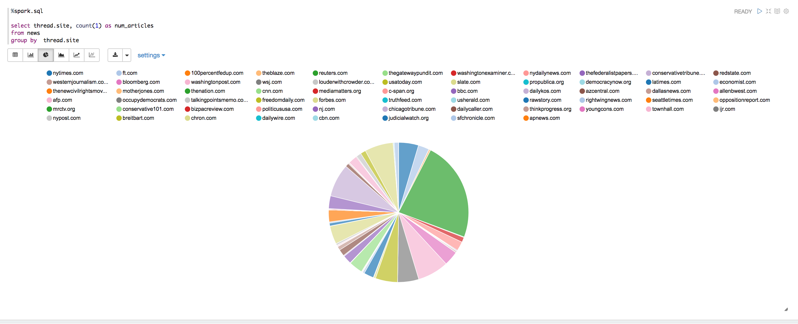

# Newspaper bias analysis

This is the code that served as basis for the blogpost [TODO Link](https://example.com).

## Data exploration & sampling

1. Download and extract [Zepellin](https://zeppelin.apache.org/docs/0.7.2/install/install.html). Then run:
2. `bin/zeppelin-daemon.sh start`
3. Go to http://localhost:8080/ and click on `Import note`
4. Open `zeppelin-notebooks/articles-stats-and-samping.json` and you should see the following:



We have [exported a CSV file](zeppelin-notebooks/articles-per-publisher.csv) that lists how many articles there are per publisher in this dataset.

## Jupyter notebooks analysis

### Requirements

#### Install a python 3 environment

You can use virtualenv or [anaconda](https://conda.io/docs/py2or3.html), as long as you have a py3 version installed.

#### Install Jupyter notebook

You can follow the instructions here: http://jupyter.readthedocs.io/en/latest/install.html
On linux or Mac OS, simply run after activating your environment: `pip install jupyter`

#### Download the training & test data (a sample of the whole dataset with about ~100K articles)

TODO: update public link.
Download https://console.aws.amazon.com/s3/object/newsclustering/filtered-csv/newsclust.csv?region=us-east-1&tab=overview and place the CSV file under data/source/newsclust.csv

### Packages required for `Report.ipynb`

```shell
pip install jupyter
pip install scikit-learn
pip install -U spacy
pip install plotly
pip install matplotlib
pip install pandas
pip install scipy
```

Once the packages have been installed, you can launch the notebook interface using `jupyter notebook` and navigate to the `python-script` directory.

### Additional packages required for `linear-model-doc2vec.ipynb, nn-classifer-xyz.ipynb`

```shell
pip install --upgrade tensorflow
pip install keras
```

For pytorch, please see install instructions: http://pytorch.org/